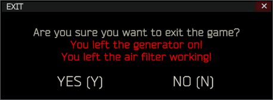

# Air Filter Warning
A simple mod that adds warning message before exiting the game when air filter is still working in your hideout.

Mod page is available on [SPT Hub](https://hub.sp-tarkov.com/files/file/2820-air-filter-warning/).

## Installation
1. Make sure that SPT Client is not running
2. Head to [releases page](https://github.com/danx91/AirFilterWarning/releases)
3. Download correct version for your SPT
4. Open zip file
5. Drag and drop `BepInEx` directory to your SPT directory
6. Start game and make sure that mod is working

## License
Copyright © 2025 danx91 (aka ZGFueDkx)
This program is free software: you can redistribute it and/or modify it under the terms of the GNU General Public License as published by the Free Software Foundation, either version 3 of the License, or (at your option) any later version.

This program is distributed in the hope that it will be useful, but WITHOUT ANY WARRANTY; without even the implied warranty of MERCHANTABILITY or FITNESS FOR A PARTICULAR PURPOSE. See the GNU General Public License for more details.

You should have received a copy of the GNU General Public License along with this program.  If not, see https://www.gnu.org/licenses/.

If you believe that this software infringes yours or someone else's copyrights, please contact me via Discord to resolve this issue: **danx91**.